# ARX_PLAY 
## System Requirement
ubuntu 20.04, 
python 3.8.10, 
ros1-noetic, 
torch-2.2.0 + cu121

## Quick Start
### 1. Download
```
mkdir ~/ARX && cd ~/ARX
git clone https://github.com/ChangerC77/ARX_PLAY.git
cd ~/ARX/ARX_PLAY
```
### 2. 创建虚拟环境
+ venv 
```
cd mobile_aloha
bash venv.sh
```
+ conda
```
cd mobile aloha
bash conda.sh
```
### 3. install dependence
```
pip install -r requirements.txt

cd detr
pip install -e .
```
### 4. cuda
```
# 安装torch-2.2.0+cuda12.1
pip install torch==2.2.0 torchvision==0.17.0 torchaudio==2.2.0 --index-url https://download.pytorch.org/whl/cu121
```
`ATTENTION`: 安装时间取决于网速，请耐心等待
output
```
Installing collected packages: mpmath, triton, sympy, nvidia-nvtx-cu12, nvidia-nvjitlink-cu12, nvidia-nccl-cu12, nvidia-curand-cu12, nvidia-cufft-cu12, nvidia-cuda-runtime-cu12, nvidia-cuda-nvrtc-cu12, nvidia-cuda-cupti-cu12, nvidia-cublas-cu12, networkx, MarkupSafe, nvidia-cusparse-cu12, nvidia-cudnn-cu12, jinja2, nvidia-cusolver-cu12, torch, torchvision, torchaudio
Successfully installed MarkupSafe-2.1.5 jinja2-3.1.4 mpmath-1.3.0 networkx-3.0 nvidia-cublas-cu12-12.1.3.1 nvidia-cuda-cupti-cu12-12.1.105 nvidia-cuda-nvrtc-cu12-12.1.105 nvidia-cuda-runtime-cu12-12.1.105 nvidia-cudnn-cu12-8.9.2.26 nvidia-cufft-cu12-11.0.2.54 nvidia-curand-cu12-10.3.2.106 nvidia-cusolver-cu12-11.4.5.107 nvidia-cusparse-cu12-12.1.0.106 nvidia-nccl-cu12-2.19.3 nvidia-nvjitlink-cu12-12.1.105 nvidia-nvtx-cu12-12.1.105 sympy-1.13.3 torch-2.2.0+cu121 torchaudio-2.2.0+cu121 torchvision-0.17.0+cu121 triton-2.2.0
```
### 5. camera
#### 1. dependences
```
sudo apt-get install -y libudev-dev pkg-config libgtk-3-dev
sudo apt-get install -y libusb-1.0-0-dev pkg-config
sudo apt-get install -y libglfw3-dev
sudo apt-get install -y libssl-dev
```
#### 2. install realsense libraries
```
cd ~/ARX
git clone https://github.com/IntelRealSense/librealsense.git
cd librealsense
mkdir build
cd build
cmake ../ -DBUILD_EXAMPLES=true
```
output
```
-- Checking internet connection...
-- Internet connection identified
-- Info: REALSENSE_VERSION_STRING=2.55.1
-- Setting Unix configurations
-- No output directory set; using /home/robotics/ARX/librealsense/build/Release/
-- Building libcurl enabled
-- Found OpenSSL: /usr/lib/x86_64-linux-gnu/libcrypto.so (found version "1.1.1f")  
-- Performing Test SUPPORTS_CXX14
-- Performing Test SUPPORTS_CXX14 - Success
-- using RS2_USE_V4L2_BACKEND
-- Found usb: /usr/lib/x86_64-linux-gnu/libusb-1.0.so  
-- Found PkgConfig: /usr/bin/pkg-config (found version "0.29.1") 
-- Checking for module 'libudev'
--   Found libudev, version 245
-- Found Udev: /usr/include  
-- Fetching nlohmann/json...
正克隆到 'json'...
HEAD 目前位于 9cca280 JSON for Modern C++ 3.11.3 (#4222)
-- Using the multi-header code from /home/robotics/ARX/librealsense/build/third-party/json/include/
-- Fetching nlohmann/json - Done
-- Found OpenGL: /usr/lib/x86_64-linux-gnu/libOpenGL.so   
-- Looking for pthread.h
-- Looking for pthread.h - found
-- Performing Test CMAKE_HAVE_LIBC_PTHREAD
-- Performing Test CMAKE_HAVE_LIBC_PTHREAD - Success
-- Found Threads: TRUE  
-- Check for updates capability added to realsense-viewer
-- Check for updates capability added to realsense-depth-quality
-- Fetching recommended firmwares:
-- disable link time optimization for fw project
-- ... https://librealsense.intel.com/Releases/RS4xx/FW/D4XX_FW_Image-5.16.0.1.bin
-- Configuring done
-- Generating done
-- Build files have been written to: /home/robotics/ARX/librealsense/build
```
```
make
sudo make install # 这里第一次编译时间很长！
```
output
```
[  5%] Built target realsense-file
[ 11%] Built target rsutils
[ 49%] Built target realsense2
[ 52%] Built target libcurl
[ 56%] Built target realsense2-gl
[ 57%] Built target rs-hello-realsense
[ 58%] Built target rs-software-device
[ 58%] Built target rs-capture
[ 59%] Built target rs-callback
[ 60%] Built target rs-save-to-disk
[ 61%] Built target rs-multicam
[ 61%] Built target rs-pointcloud
[ 63%] Built target rs-align
[ 64%] Built target rs-align-gl
[ 65%] Built target rs-align-advanced
[ 65%] Built target rs-sensor-control
[ 65%] Built target rs-measure
[ 66%] Built target rs-depth
[ 67%] Built target rs-color
[ 67%] Built target rs-distance
[ 69%] Built target rs-post-processing
[ 71%] Built target rs-record-playback
[ 72%] Built target rs-motion
[ 73%] Built target rs-gl
[ 74%] Built target rs-hdr
[ 75%] Built target rs-convert
[ 75%] Built target rs-enumerate-devices
[ 76%] Built target rs-fw-logger
[ 76%] Built target rs-terminal
[ 76%] Built target rs-record
[ 76%] Built target rs-fw-update
[ 77%] Built target rs-embed
[ 77%] Built target rs-data-collect
[ 77%] Built target fw
[ 87%] Built target realsense-viewer
[ 97%] Built target rs-depth-quality
[ 99%] Built target rs-rosbag-inspector
[100%] Built target rs-benchmark
Install the project...
-- Install configuration: "Release"
-- Installing: /usr/local/lib/librealsense2.so.2.55.1
-- Installing: /usr/local/lib/librealsense2.so.2.55
-- Installing: /usr/local/lib/librealsense2.so
-- Installing: /usr/local/include/librealsense2
-- Installing: /usr/local/include/librealsense2/rs.h
-- Installing: /usr/local/include/librealsense2/rsutil.h
-- Installing: /usr/local/include/librealsense2/rs_advanced_mode.h
-- Installing: /usr/local/include/librealsense2/rs_advanced_mode.hpp
-- Installing: /usr/local/include/librealsense2/hpp
-- Installing: /usr/local/include/librealsense2/hpp/rs_device.hpp
-- Installing: /usr/local/include/librealsense2/hpp/rs_record_playback.hpp
-- Installing: /usr/local/include/librealsense2/hpp/rs_options.hpp
-- Installing: /usr/local/include/librealsense2/hpp/rs_export.hpp
-- Installing: /usr/local/include/librealsense2/hpp/rs_pipeline.hpp
-- Installing: /usr/local/include/librealsense2/hpp/rs_internal.hpp
-- Installing: /usr/local/include/librealsense2/hpp/rs_sensor.hpp
-- Installing: /usr/local/include/librealsense2/hpp/rs_frame.hpp
-- Installing: /usr/local/include/librealsense2/hpp/rs_context.hpp
-- Installing: /usr/local/include/librealsense2/hpp/rs_serializable_device.hpp
-- Installing: /usr/local/include/librealsense2/hpp/rs_types.hpp
-- Installing: /usr/local/include/librealsense2/hpp/rs_processing.hpp
-- Installing: /usr/local/include/librealsense2/rs.hpp
-- Installing: /usr/local/include/librealsense2/h
-- Installing: /usr/local/include/librealsense2/h/rs_sensor.h
-- Installing: /usr/local/include/librealsense2/h/rs_record_playback.h
-- Installing: /usr/local/include/librealsense2/h/rs_processing.h
-- Installing: /usr/local/include/librealsense2/h/rs_frame.h
-- Installing: /usr/local/include/librealsense2/h/rs_types.h
-- Installing: /usr/local/include/librealsense2/h/rs_advanced_mode_command.h
-- Installing: /usr/local/include/librealsense2/h/rs_pipeline.h
-- Installing: /usr/local/include/librealsense2/h/rs_context.h
-- Installing: /usr/local/include/librealsense2/h/rs_option.h
-- Installing: /usr/local/include/librealsense2/h/rs_internal.h
-- Installing: /usr/local/include/librealsense2/h/rs_device.h
-- Installing: /usr/local/include/librealsense2/h/rs_config.h
-- Installing: /usr/local/lib/cmake/realsense2/realsense2Targets.cmake
-- Installing: /usr/local/lib/cmake/realsense2/realsense2Targets-release.cmake
-- Installing: /usr/local/lib/cmake/realsense2/realsense2Config.cmake
-- Installing: /usr/local/lib/cmake/realsense2/realsense2ConfigVersion.cmake
-- Installing: /usr/local/lib/pkgconfig/realsense2.pc
-- Installing: /usr/local/lib/librsutils.a
-- Installing: /usr/local/lib/librealsense-file.a
-- Installing: /usr/local/lib/librealsense2-gl.so.2.55.1
-- Installing: /usr/local/lib/librealsense2-gl.so.2.55
-- Set runtime path of "/usr/local/lib/librealsense2-gl.so.2.55.1" to ""
-- Installing: /usr/local/lib/librealsense2-gl.so
-- Installing: /usr/local/include/librealsense2-gl/rs_processing_gl.h
-- Installing: /usr/local/include/librealsense2-gl/rs_processing_gl.hpp
-- Installing: /usr/local/lib/cmake/realsense2-gl/realsense2-glTargets.cmake
-- Installing: /usr/local/lib/cmake/realsense2-gl/realsense2-glTargets-release.cmake
-- Installing: /usr/local/lib/cmake/realsense2-gl/realsense2-glConfig.cmake
-- Installing: /usr/local/lib/cmake/realsense2-gl/realsense2-glConfigVersion.cmake
-- Installing: /usr/local/lib/pkgconfig/realsense2-gl.pc
-- Installing: /usr/local/bin/rs-hello-realsense
-- Set runtime path of "/usr/local/bin/rs-hello-realsense" to ""
-- Installing: /usr/local/bin/rs-software-device
-- Set runtime path of "/usr/local/bin/rs-software-device" to ""
-- Installing: /usr/local/bin/rs-capture
-- Set runtime path of "/usr/local/bin/rs-capture" to ""
-- Installing: /usr/local/bin/rs-callback
-- Set runtime path of "/usr/local/bin/rs-callback" to ""
-- Installing: /usr/local/bin/rs-save-to-disk
-- Set runtime path of "/usr/local/bin/rs-save-to-disk" to ""
-- Installing: /usr/local/bin/rs-multicam
-- Set runtime path of "/usr/local/bin/rs-multicam" to ""
-- Installing: /usr/local/bin/rs-pointcloud
-- Set runtime path of "/usr/local/bin/rs-pointcloud" to ""
-- Installing: /usr/local/bin/rs-align
-- Set runtime path of "/usr/local/bin/rs-align" to ""
-- Installing: /usr/local/bin/rs-align-gl
-- Set runtime path of "/usr/local/bin/rs-align-gl" to ""
-- Installing: /usr/local/bin/rs-align-advanced
-- Set runtime path of "/usr/local/bin/rs-align-advanced" to ""
-- Installing: /usr/local/bin/rs-sensor-control
-- Set runtime path of "/usr/local/bin/rs-sensor-control" to ""
-- Installing: /usr/local/bin/rs-measure
-- Set runtime path of "/usr/local/bin/rs-measure" to ""
-- Installing: /usr/local/bin/rs-depth
-- Set runtime path of "/usr/local/bin/rs-depth" to ""
-- Installing: /usr/local/bin/rs-color
-- Set runtime path of "/usr/local/bin/rs-color" to ""
-- Installing: /usr/local/bin/rs-distance
-- Set runtime path of "/usr/local/bin/rs-distance" to ""
-- Installing: /usr/local/bin/rs-post-processing
-- Set runtime path of "/usr/local/bin/rs-post-processing" to ""
-- Installing: /usr/local/bin/rs-record-playback
-- Set runtime path of "/usr/local/bin/rs-record-playback" to ""
-- Installing: /usr/local/bin/rs-motion
-- Set runtime path of "/usr/local/bin/rs-motion" to ""
-- Installing: /usr/local/bin/rs-gl
-- Set runtime path of "/usr/local/bin/rs-gl" to ""
-- Installing: /usr/local/bin/rs-hdr
-- Set runtime path of "/usr/local/bin/rs-hdr" to ""
-- Installing: /usr/local/bin/rs-convert
-- Set runtime path of "/usr/local/bin/rs-convert" to ""
-- Installing: /usr/local/bin/rs-enumerate-devices
-- Set runtime path of "/usr/local/bin/rs-enumerate-devices" to ""
-- Installing: /usr/local/bin/rs-fw-logger
-- Set runtime path of "/usr/local/bin/rs-fw-logger" to ""
-- Installing: /usr/local/bin/rs-terminal
-- Set runtime path of "/usr/local/bin/rs-terminal" to ""
-- Installing: /usr/local/bin/rs-record
-- Set runtime path of "/usr/local/bin/rs-record" to ""
-- Installing: /usr/local/bin/rs-fw-update
-- Set runtime path of "/usr/local/bin/rs-fw-update" to ""
-- Installing: /usr/local/bin/rs-embed
-- Installing: /usr/local/bin/rs-data-collect
-- Set runtime path of "/usr/local/bin/rs-data-collect" to ""
-- Installing: /usr/local/bin/realsense-viewer
-- Set runtime path of "/usr/local/bin/realsense-viewer" to ""
-- Installing: /home/tars/Documents/librealsense2/presets
-- Installing: /home/tars/Documents/librealsense2/presets/sample.preset
-- Installing: /usr/local/bin/rs-depth-quality
-- Set runtime path of "/usr/local/bin/rs-depth-quality" to ""
-- Installing: /usr/local/bin/rs-rosbag-inspector
-- Set runtime path of "/usr/local/bin/rs-rosbag-inspector" to ""
-- Installing: /usr/local/bin/rs-benchmark
-- Set runtime path of "/usr/local/bin/rs-benchmark" to ""
-- Installing: /usr/local/lib/libfw.a
```
#### 3. add udev rules
```
cd ~/ARX/librealsense
sudo cp config/99-realsense-libusb.rules /etc/udev/rules.d/
sudo udevadm control --reload-rules && udevadm trigger
```
#### 4. build 
```
cd ~/ARX/ARX_PLAY/realsense_camera
sudo apt install -y ros-noetic-ddynamic-reconfigure
catkin_make
```
#### 5. start camera node
connect three cameras with computer
```
source ./devel/setup.zsh
rosrun realsense2_camera list_devices_node
```
output (d405 * 3)
```
Found the following devices:

Serial number: 218622278824
Serial number: 218622278724
Serial number: 218622278932
```
将获取到的`Serial number`分别填入`src/ros_realsense2_camera/launch`中的
`rs_multiple_devices.launch`文件里的`serial_no_camera`中
```
sudo vim ~/ARX/ARX_PLAY/realsense_camera/src/ros_realsense2_camera/launch/rs_multiple_devices.launch
```
```
  <arg name="serial_no_camera1"         default="218622278824"/>
  <arg name="serial_no_camera2"         default="218622278724"/>
  <arg name="serial_no_camera3"         default="218622278932"/>
```
### 6. Download R5
```
cd ~/ARX
git clone -b dev https://github.com/ChangerC77/R5.git
```
follow the tutorials in `https://github.com/ChangerC77/R5.git`
### 7. build ARX_PLAY
`ATTENTION`: after installing `R5`, you can follow the step 7, otherwise it will occur errors.
```
 cd ~/ARX/ARX_PLAY
./make.sh
```
## Data Collection
### 1. Hardware Setting
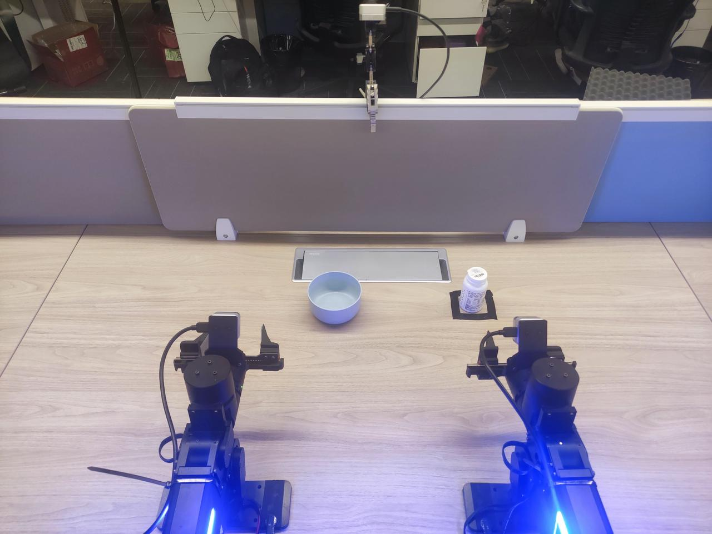

### 2. Start camera
```
cd ~/ARX/ARX_PLAY/realsense_camera
./realsense.sh
```
`ATTENTION`: 一定要确保每个`camera`都打开，有时候报错是因为`camera`掉线
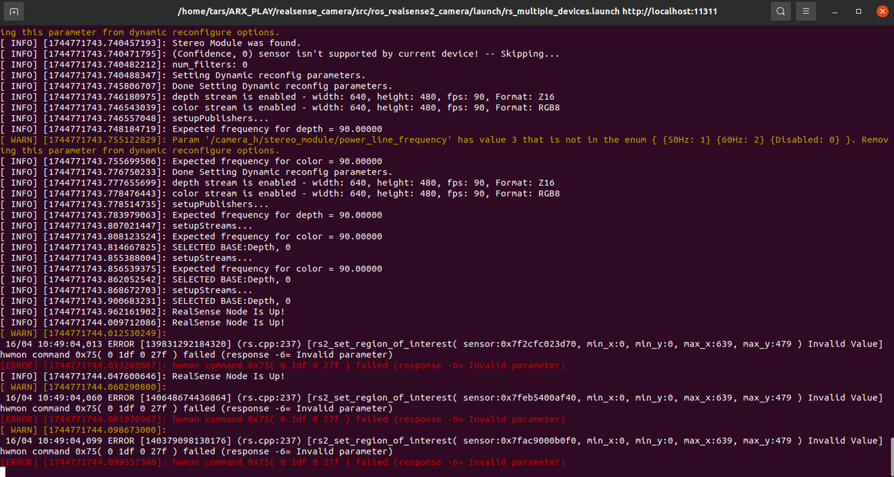

`ATTENTION`: 这个输出红色是没有问题的
### 3. visualization
```
rqt_image_view
```
三个摄像头分别对应3个不同的topic
1. 左臂`camera: /camera_l/color/image_raw`
2. 右臂`camera: /camera_r/color/image_raw`
3. 第三视角`camera: /camera_h/color/image_raw`

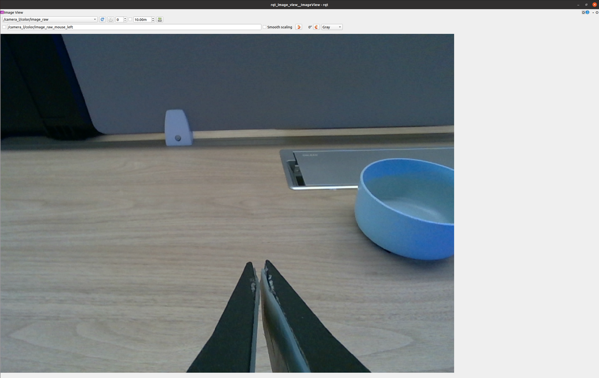
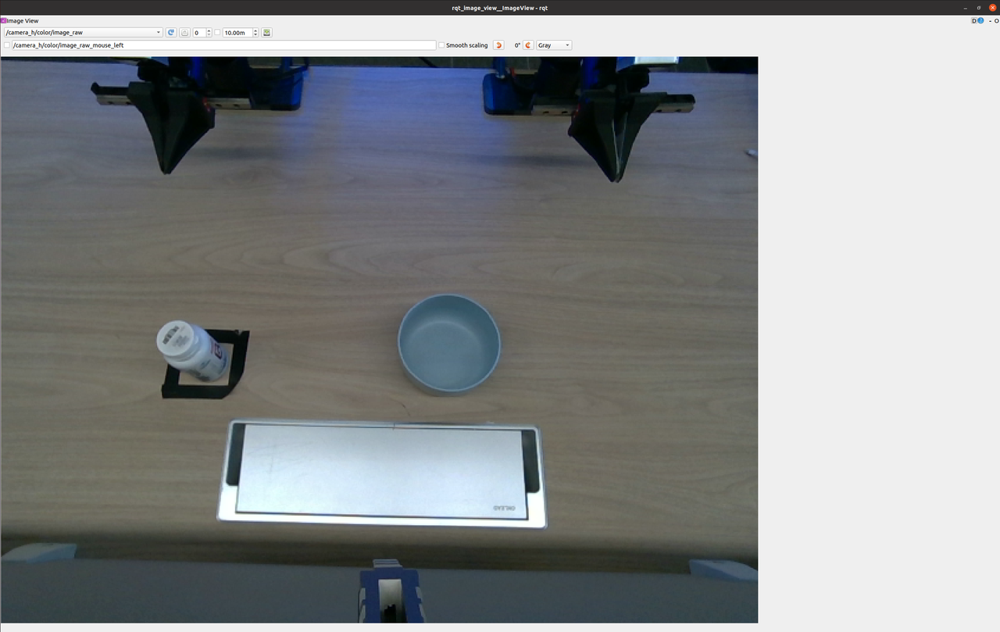
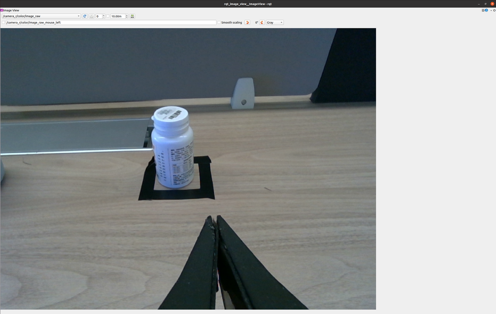

### 4. Start ARX + VR
connect VR with PC
+ conda
```
conda activate arx
cd ~/ARX/R5/00-sh/ROS
./05double_vr.sh
```
after executing this step, you can enter `APP` in VR to activate 
### 5. Start data collection
+ venv
```
source ~/ARX/ARX_PLAY/mobile_aloha/venv/bin/activate
cd ~/ARX/ARX_PLAY/mobile_aloha
python collect_data.py
```
+ conda
```
conda activate arx
cd ~/ARX/ARX_PLAY/mobile_aloha
python collect_data.py
``` 
+ bug
```
Traceback (most recent call last):
  File "collect_data.py", line 454, in <module>
    main(args)
  File "collect_data.py", line 404, in main
    collect_detect(current_episode, voice_engine, ros_operator)
  File "collect_data.py", line 96, in collect_detect
    obs_dict = ros_operator.get_observation()
  File "/home/robotics/ARX/ARX_PLAY/mobile_aloha/utils/ros_operator.py", line 393, in get_observation
    img_data[cam_name] = self.bridge.imgmsg_to_cv2(deque_map[cam_name].pop(),
  File "/opt/ros/noetic/lib/python3/dist-packages/cv_bridge/core.py", line 163, in imgmsg_to_cv2
    dtype, n_channels = self.encoding_to_dtype_with_channels(img_msg.encoding)
  File "/opt/ros/noetic/lib/python3/dist-packages/cv_bridge/core.py", line 99, in encoding_to_dtype_with_channels
    return self.cvtype2_to_dtype_with_channels(self.encoding_to_cvtype2(encoding))
  File "/opt/ros/noetic/lib/python3/dist-packages/cv_bridge/core.py", line 91, in encoding_to_cvtype2
    from cv_bridge.boost.cv_bridge_boost import getCvType
ImportError: /lib/x86_64-linux-gnu/libp11-kit.so.0: undefined symbol: ffi_type_pointer, version LIBFFI_BASE_7.0
```
+ solution
```
ls -l /lib/x86_64-linux-gnu/libp11-kit.so.0
```
output
```
lrwxrwxrwx 1 root root 19 4月   5 13:59 /lib/x86_64-linux-gnu/libp11-kit.so.0 -> libp11-kit.so.0.3.0
```
```
ln -sf lib/x86_64-linux-gnu/libffi.so.7 ~/system/miniconda3/envs/arx/lib/libffi.so.7
```
进入`VR`之后按第二次复位`A`和`X`开始录制
结束的之后按一次复位`A`和`X`结束录制
output
```
Episode 0
Preparing to record episode 2
waiting 0 to start recording
Start recording program...
init for 2
ready_flag=1: action[idx]=1.0116729736328125
ready_flag=2: action[idx]=0.037384033203125
go
Start to record episode 2
there is no base_pose_deque
Frame data: 1
...
Frame data: 612
Back to init

len(timesteps): 612
len(actions)  : 612

Saving: 1.1 secs. /home/tars/ARX_PLAY/mobile_aloha/datasets/episode_0
```
### 6. check the data
```
python mobile_aloha/check_data.py
```
### 7. replay the data
```
python mobile_aloha/replay.py
```
### 8. visualize the dataset
```
cd ~/ARX/ARX_PLAY/mobile_aloha
python visualize_episodes.py --datasets '/home/tars/ARX_PLAY/mobile_aloha/datasets'
```
output
```
output
hdf5 loaded!!
Saved video to: /home/tars/ARX_PLAY/mobile_aloha/datasets/episode_0_video.mp4
Saved qpos plot to: /home/tars/ARX_PLAY/mobile_aloha/datasets/episode_0_qpos.png
Saved qpos plot to: /home/tars/ARX_PLAY/mobile_aloha/datasets/episode_0_qvel.png
Saved gpos plot to: /home/tars/ARX_PLAY/mobile_aloha/datasets/episode_0_gpos.png
Saved effort plot to: /home/tars/ARX_PLAY/mobile_aloha/datasets/episode_0_action_base.png
```
### 9. dataset
#### 1. episode_0_action_base.png

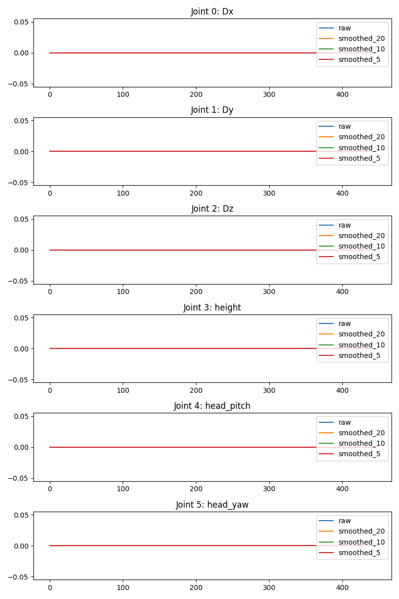

#### 2. episode_0_gpos.png

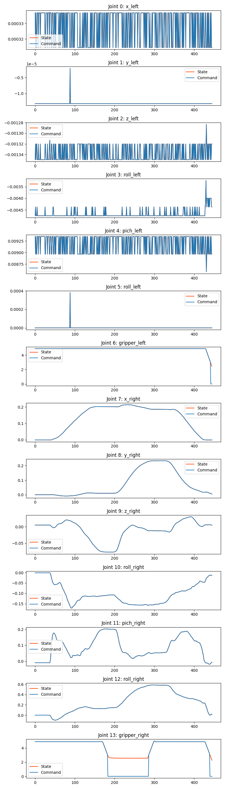

#### 3. episode_0_qpos.png

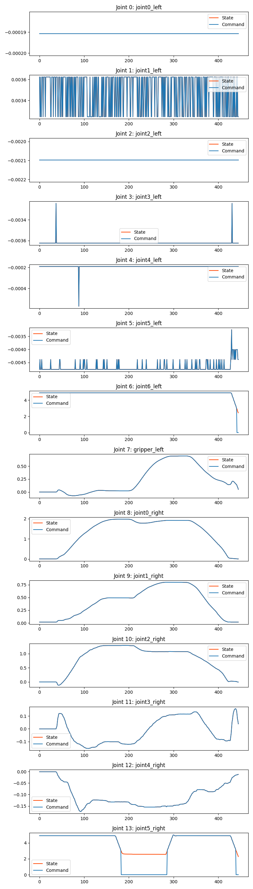

#### 4. episode_0_qvel.png

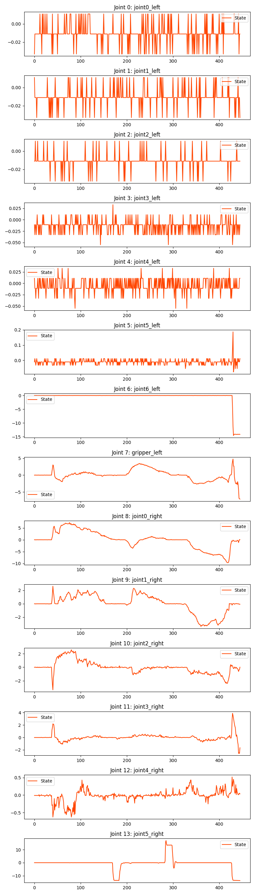

## Training
+ venv
```
cd ~/ARX/ARX_PLAY/mobile_aloha
source /home/tars/ARX_PLAY/mobile_aloha/venv/bin/activate
CUDA_VISIBLE_DEVICES=0 python train.py --datasets datasets --ckpt_dir weights --num_episodes 30 --batch_size 8 --epochs 700
```
+ conda
```
cd ~/ARX/ARX_PLAY/mobile_aloha
conda activate arx
CUDA_VISIBLE_DEVICES=0 python train.py --datasets datasets --ckpt_dir weights --num_episodes 30 --batch_size 8 --epochs 700
```
`CUDA_VISIBLE_DEVICES`:使用显卡数量
`datasets`: 数据集地址
`num_episodes`: 数据集数量
`batch_size`: GPU显存小的话，这个设置为8或者更小
`epochs`: 训练一般500就收敛了，再往后就过拟合了，所以不需要按照原项目的3000

### loss
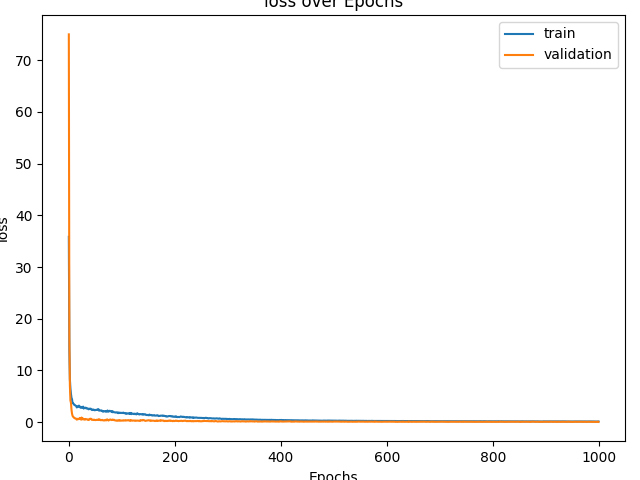

### kl
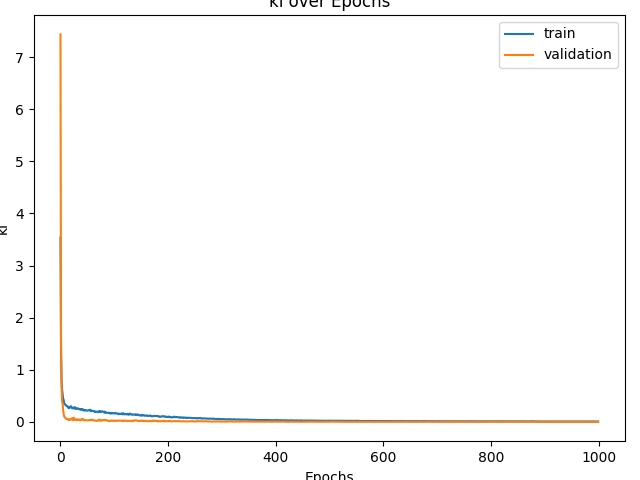

### l1
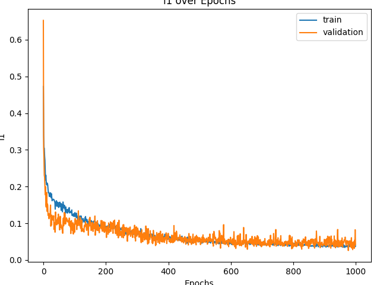


## Model Deployment
### Start R5
```
cd ~/ARX/R5
source ~/ARX/R5/ROS/R5_ws/devel/setup.bash
roslaunch arx_r5_controller open_remote_slave.launch
```
+ topic
```
rostopic list
```
```
/arm_l/end_effector_extra_mass
/arm_r/end_effector_extra_mass
/follow1_pos_back
/follow2_pos_back
/joint_control
/joint_control2
/joint_information
/joint_information2
/rosout
/rosout_agg
```
+ 机械臂控制信息
```
rostopic echo /joint_control
rostopic echo /joint_control2
```
### Inference
```
cd ~/ARX/ARX_PLAY/mobile_aloha
source ~/ARX_PLAY/mobile_aloha/venv/bin/activate
python inference.py --ckpt_dir weights --ckpt_name policy_epoch_690_seed_0.ckpt
```
# bug
## 1. can口通讯问题
出现这个问题，要关闭机械臂，插拔插口，休息一会儿再连接
```
process[arm_r-2]: started with pid [3138]
[ INFO] [1745500135.903323125]: ????????????????????????...
[ INFO] [1745500135.905788448]: ????????????????????????...
[ WARN] [1745500135.908694024]: The root link base_link has an inertia specified in the URDF, but KDL does not support a root link with an inertia.  As a workaround, you can add an extra dummy link to your URDF.
SocketCAN adapter created.
Created CAN socket with descriptor 10.
Unable to select CAN interface can1: I/O control error
Waiting for receiver thread to terminate.
terminate_receiver_thread_ is true
waitting receiver_thread close
[ WARN] [1745500135.909931874]: The root link base_link has an inertia specified in the URDF, but KDL does not support a root link with an inertia.  As a workaround, you can add an extra dummy link to your URDF.
SocketCAN adapter created.
Created CAN socket with descriptor 10.
Unable to select CAN interface can3: I/O control error
Waiting for receiver thread to terminate.
terminate_receiver_thread_ is true
waitting receiver_thread close
waitting receiver_thread close
waitting receiver_thread close
^C[arm_r-2] killing on exit
waitting receiver_thread close
[arm_l-1] killing on exit
```
## 2. camera问题
这个问题是因为camera掉线，需要重启camera
```
syn fail
there is no head_deque
syn fail
there is no head_deque
syn fail
there is no head_deque
syn fail
there is no head_deque
syn fail
there is no head_deque
syn fail
there is no head_deque
syn fail
there is no head_deque
syn fail
there is no head_deque
syn fail
there is no head_deque
syn fail
there is no head_deque
```
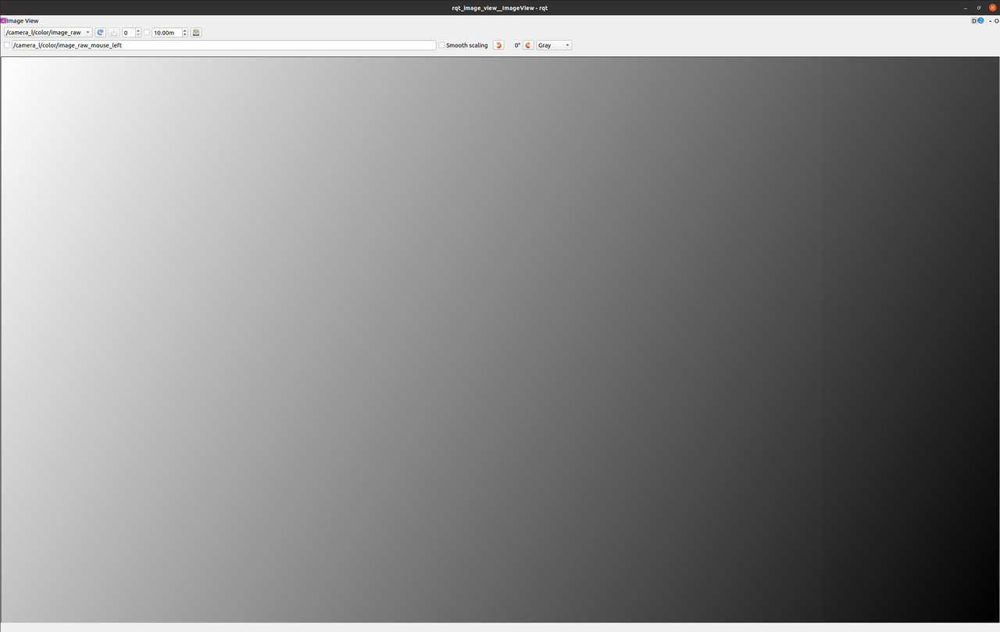
